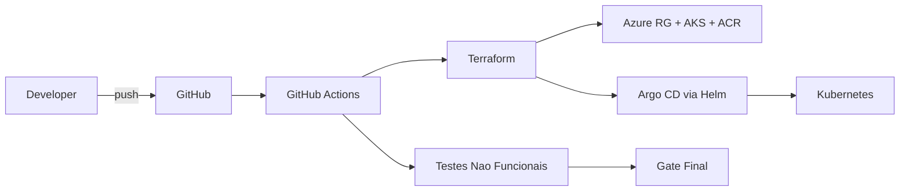
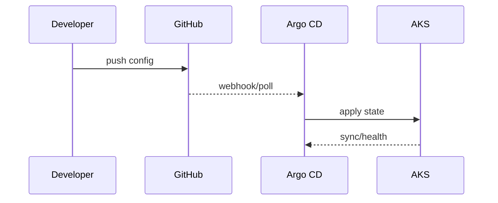

# Architecture

## Scope
The framework provides:
- GitOps control plane (Argo CD)
- Kubernetes runtime (AKS)
- Optional observability components
- Continuous testing gates (performance + resilience)

## High-level architecture

## Terraform modules
The infrastructure is organized as modular Terraform with four child modules:
- **cluster**: Resource Group, VNet, Subnet, ACR, AKS, AcrPull role assignment
- **argocd**: Kubernetes/Helm providers + Argo CD Helm release (ClusterIP)
- **ingress**: Optional Public IP and networking RG for Argo CD exposure
- **external-secrets**: Optional Key Vault, User Assigned Identity, Federated Identity Credential, External Secrets Operator

## Resource Groups
- **rg-ct-framework**: Main RG for AKS, VNet, ACR (deleted by `terraform destroy`)

## Network
- O serviço `argocd-server` é `ClusterIP`.
- O acesso administrativo é feito por túnel local com `kubectl port-forward`.
- URL de acesso local: `https://localhost:8080`.

## Identity and access
- Azure OIDC para pipeline (GitHub Actions).
- Identidade gerenciada opcional para External Secrets + Key Vault.

## Sequence (GitOps sync)

