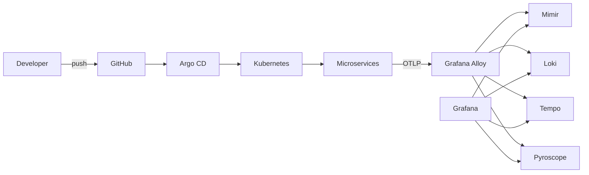
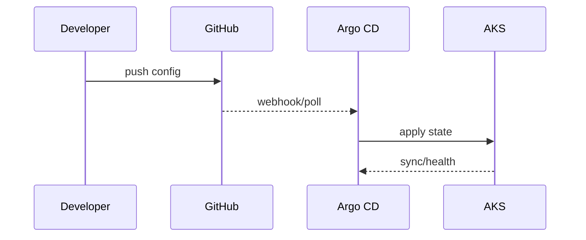

# Architecture

## Scope
The framework provides:
- GitOps platform (Argo CD)
- Kubernetes runtime (AKS)
- Observability (Grafana stack via OTLP)
- Continuous testing gates (pre/post deploy)

## High-level architecture

## Resource Groups
- **rg-ct-framework**: Main RG for AKS, VNet, ACR (deleted by `terraform destroy`)
- **rg-ct-framework-networking**: Persistent RG for static public IP (manually created, NOT deleted by terraform)
  - Static IP must be created manually before bootstrap: `az network public-ip create -g rg-ct-framework-networking -n ingress-ct-framework --sku Standard --allocation-method Static`
  - Ensures DNS stability across infrastructure rebuild cycles

## Network
- Ingress NGINX exposes Argo CD with TLS and Basic Auth.
- Static public IP in rg-ct-framework-networking persists across `terraform destroy` cycles.
- Argo CD routes to ClusterIP services.

## Identity and access
- Basic Auth at Ingress for UI gate.
- Argo CD admin credentials stored in secret.
- Git access via PAT secret.

## Sequence (GitOps sync)

