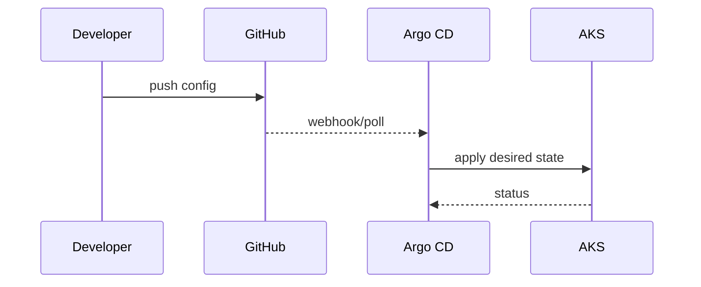

# GitOps model

## Repos
- GitOps repo (central): Argo CD apps, ingress, platform add-ons.
- Services repo: Helm chart and values for each microservice.

## GitOps repo structure
```
argocd-ingress/
apps-core/
apps-o11y/
overlays/
root-app.yaml
root-app-o11y.yaml
applicationset-scm.yaml
```

## Repo responsibilities
- apps-core: ingress, access, and core services apps.
- apps-o11y: Grafana stack apps (Mimir, Loki, Tempo, Pyroscope, Alloy).
- argocd-ingress: ConfigMap + Ingress for Argo CD.

## ApplicationSet (auto-discovery)
- applicationset-scm.yaml scans GitHub org for repos with prefix svc-*
- each repo must expose deploy/helm

## Repo access
- If GitOps repo is private, prefer External Secrets + Key Vault.
- Fallback: create a GitHub PAT secret in argocd (argocd-repo-*).
- For SCM provider, create the github-token secret.

## Good practices
- Commit and push any change before expecting Argo CD to sync it.
- Use overlays (deploy/gitops/overlays) to avoid in-place edits.
- Keep app manifests small and controlled (avoid direct kubectl apply).

## Sequence (GitOps sync)

