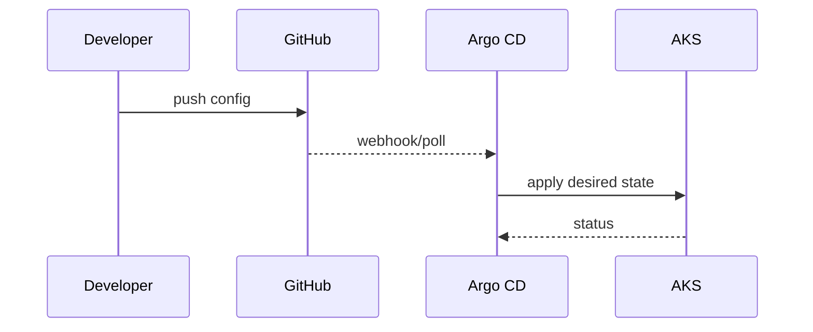

# GitOps model

## Papel do Argo CD neste projeto
- Argo CD é instalado e exposto pelo Terraform.
- O repositório atual fornece:
  - chart base em `deploy/helm/service-chart`;
  - values por serviço em `deploy/helm/values`.

## Fluxo recomendado
1. Manifests/values versionados em Git.
2. Aplicação registrada no Argo CD.
3. Sincronização para AKS com política definida no Argo.

## Good practices
- Evitar alterações manuais fora do Git.
- Versionar mudanças de chart e values junto das mudanças de aplicação.
- Definir sync policy explícita por aplicação (manual ou automática).

## Sequence (GitOps sync)

