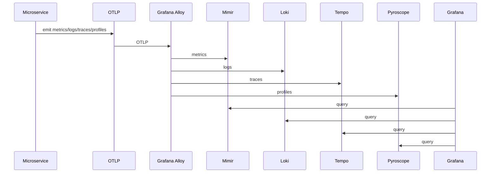

# Observability (OTLP + Grafana stack)

## Goal
Centralize metrics, logs, traces, and profiles using only OTLP and Grafana stack components.

## Components
- Grafana (dashboards)
- Mimir (metrics)
- Loki (logs)
- Tempo (traces)
- Pyroscope (profiles)
- Alloy (OTLP ingest + discovery)

## Enable
- Deploy root-app-o11y.yaml (GitOps repo)
- Ensure namespaces: observability

## OTLP conventions
- OTEL_EXPORTER_OTLP_ENDPOINT points to Alloy
- OTEL_SERVICE_NAME per microservice
- Standard attributes: service.namespace, service.instance.id, cloud.provider

## Discovery
- Kubernetes discovery in Alloy for pods/services
- Azure discovery for managed resources

## Data flow (sequence)

