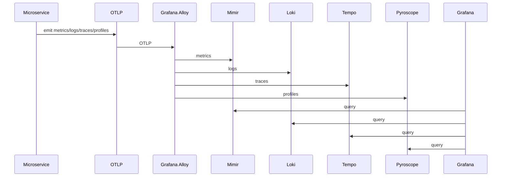

# Observability (OTLP + Grafana stack)

## Goal
Centralizar métricas, logs, traces e profiles.

## Components
- Grafana
- Mimir
- Loki
- Tempo
- Pyroscope
- Alloy

## Estado no repositório
- Values de referência em `deploy/helm/observability/`.
- A implantação da stack completa é opcional e pode ser adicionada ao fluxo GitOps do ambiente.

## OTLP conventions
- OTEL_EXPORTER_OTLP_ENDPOINT points to Alloy
- OTEL_SERVICE_NAME per microservice
- Standard attributes: service.namespace, service.instance.id, cloud.provider

## Discovery
- Kubernetes discovery in Alloy for pods/services
- Azure discovery for managed resources

## Data flow (sequence)

