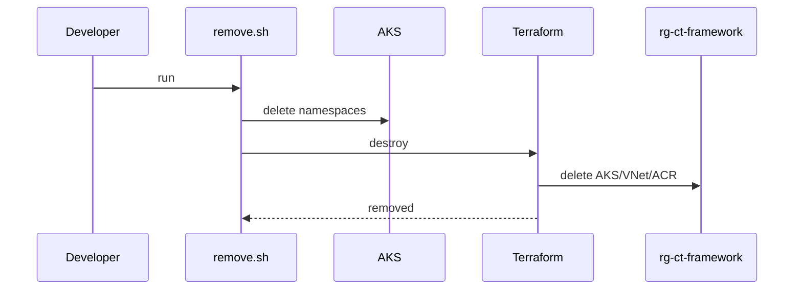

# Operations

## Remove everything

```
cd scripts
SUBSCRIPTION_ID=<your-subscription-id> ./remove.sh
```

**Note**: This removes AKS, VNet, and ACR from `rg-ct-framework`.

## Runbooks
- Argo CD não responde: `kubectl -n argocd get svc argocd-server -o wide`.
- Tipo de serviço incorreto: validar `kubectl -n argocd get svc argocd-server -o jsonpath='{.spec.type}'` (esperado: `ClusterIP`).
- Health endpoint falhando: validar túnel local com `kubectl -n argocd port-forward svc/argocd-server 8080:443` e `curl -k https://localhost:8080/healthz`.
- Erro `cannot re-use a name that is still in use` no bootstrap: o script tenta recuperar automaticamente com `terraform import helm_release.argocd argocd/argocd` e reaplica o plano.

## Remove sequence

