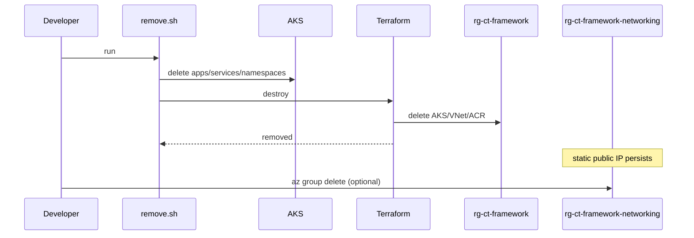

# Operations

## Remove everything

```
cd scripts
SUBSCRIPTION_ID=<your-subscription-id> ./remove.sh
```

**Note**: This removes AKS, VNet, and ACR from rg-ct-framework. The static public IP in rg-ct-framework-networking persists. To fully clean up:

```bash
az group delete --name rg-ct-framework-networking
```

## Runbooks
- Repo auth error in Argo CD: confirm Key Vault secrets or fallback repo secret.
- App path not found: commit and push GitOps repo changes.
- Ingress not reachable: verify LoadBalancer IP, backend pool registration, and DNS.
- Basic auth fails: regenerate ARGOCD_BASIC_AUTH and recreate secret.
- Argo CD URL incorrect: update deploy/gitops/overlays/corporate/values.env and re-apply overlay.

## Remove sequence

