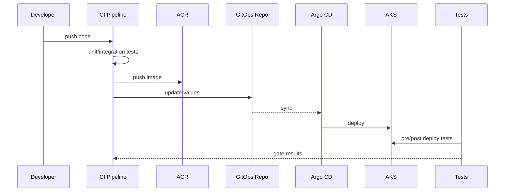

# CI/CD and pipeline

## Stages
1) Build and test
2) Container image publish
3) GitOps update (values/versions)
4) Continuous tests (pre-deploy)
5) Deploy via Argo CD
6) Post-deploy tests and gates

## Sequence (pipeline)

