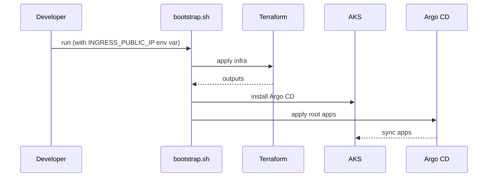
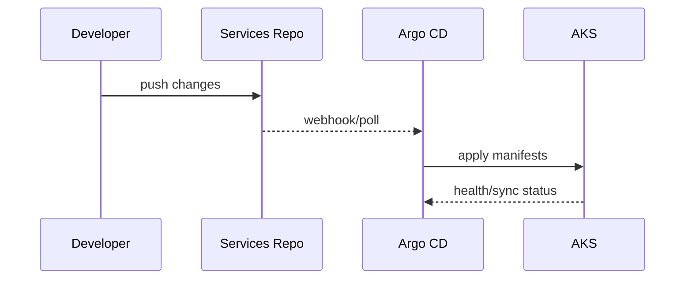

# Quickstart

## 0) Create networking resource group

The networking Resource Group persists after `terraform destroy`, preserving the static public IP:

```bash
az group create \
  --name rg-ct-framework-networking \
  --location brazilsouth
```

## 1) Create static public IP

```bash
az network public-ip create \
  -g rg-ct-framework-networking \
  -n ingress-ct-framework \
  --sku Standard \
  --allocation-method Static

# Get the IP address
INGRESS_IP=$(az network public-ip show \
  -g rg-ct-framework-networking \
  -n ingress-ct-framework \
  --query ipAddress -o tsv)
```

## 2) Terraform
Update infra/terraform/terraform.tfvars with your defaults and optional corporate flags.

Apply:

```bash
cd infra/terraform
terraform init
terraform plan -out tfplan
terraform apply -auto-approve tfplan
```

## 3) External Secrets (optional)
If using Key Vault for repo credentials:

```bash
az keyvault secret set --vault-name <KV_NAME> --name argocd-repo-token --value "<GITHUB_PAT>"
az keyvault secret set --vault-name <KV_NAME> --name argocd-basic-auth --value "admin:$(openssl passwd -apr1 'SENHA')"
```

Update overlay values in deploy/gitops/overlays/corporate/values.env:
- tenantId
- keyVaultUrl

## 4) Bootstrap
```bash
cd scripts
SUBSCRIPTION_ID=<your-subscription-id> \
INGRESS_PUBLIC_IP=<the-static-ip> \
REPO_URL=https://github.com/Dorigao-LTDA/central-gitops.git \
SERVICES_REPO_URL=https://github.com/Dorigao-LTDA/continuous-testing-framework.git \
ARGOCD_DOMAIN=argocd.dorigao.dev.br \
SKIP_BOOTSTRAP_REPO_SECRET=1 \
./bootstrap.sh
```

Required variables:
- **INGRESS_PUBLIC_IP**: The static public IP created in step 1 (e.g., 20.197.180.231)
- **SUBSCRIPTION_ID**: Your Azure subscription ID

Bootstrap behavior:
- Generates Basic Auth if ARGOCD_BASIC_AUTH is empty.
- Creates TLS secret if ARGOCD_TLS_CERT_FILE/ARGOCD_TLS_KEY_FILE are set.
- Applies GitOps overlays instead of editing files in place.

## 5) DNS
- A record: argocd.dorigao.dev.br -> ingress public IP
- CNAME: argocd.dorigao.dev.br -> ingress hostname (if provided by cloud)

## 6) Access
- URL: https://argocd.dorigao.dev.br
- Basic auth: admin + ARGOCD_BASIC_AUTH password
- Argo CD admin password:
  - kubectl -n argocd get secret argocd-initial-admin-secret -o jsonpath="{.data.password}" | base64 -d

## 7) First sync
- Open Argo CD and force sync of ct-framework.
- If repo auth fails, confirm Key Vault secrets or fallback repo secret (see gitops.md).

## Sequence (bootstrap)


## Sequence (service deploy)

