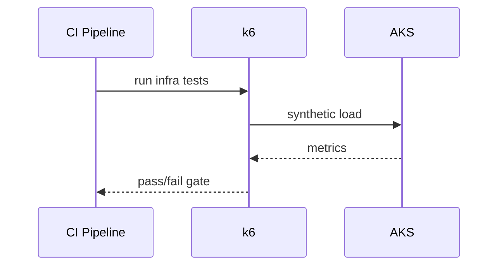
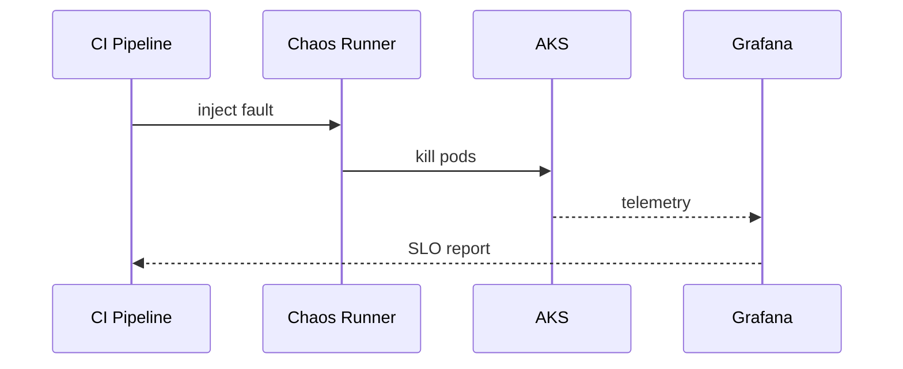

# Testing and gates

## Test types
- Pre-deploy infra performance (k6)
- Post-deploy performance (k6)
- Resilience test (pod failure + deployment recovery)

## Gates
- Latency p95 and error rate thresholds
- Recovery after failure injection
- Final PASS/FAIL report from `scripts/evaluate-gates.sh`

## Thresholds atuais (k6)
- `http_req_failed < 1%`
- `http_req_duration p95 < 300ms`

## Execução local
```bash
TARGET_URL=https://localhost:8080/healthz ./scripts/run-perf.sh predeploy
TARGET_URL=https://localhost:8080/healthz ./scripts/run-perf.sh postdeploy
./scripts/run-resilience.sh
```

## Artefatos de pipeline
- `reports/predeploy-summary.json`
- `reports/postdeploy-summary.json`
- `reports/resilience-status.txt`
- `reports/report.md`

## Sequence (pre-deploy)


## Sequence (chaos)

