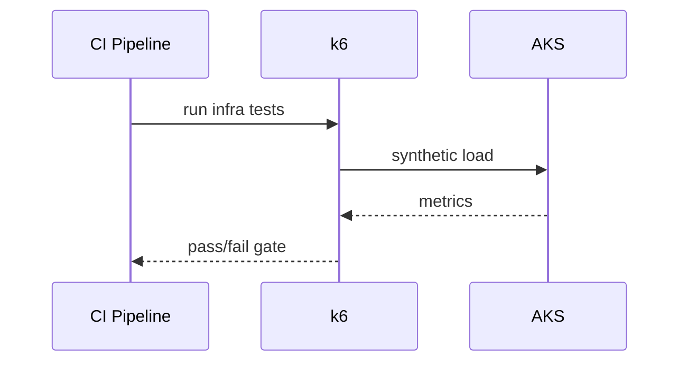
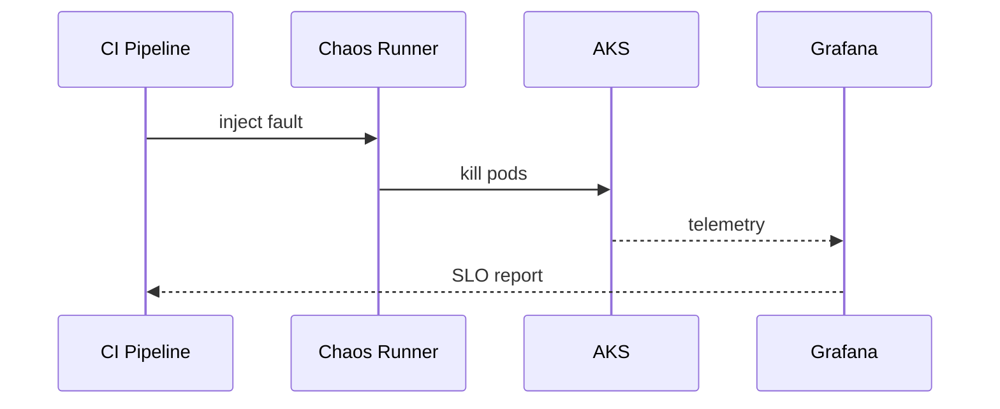

# Testing and gates

## Test types
- Pre-deploy infra performance (k6)
- Post-deploy performance (k6)
- Chaos tests (pod kill)

## Gates
- Latency p95 and error rate thresholds
- Availability during chaos events
- SLO compliance per service

## Sequence (pre-deploy)

## Sequence (chaos)

